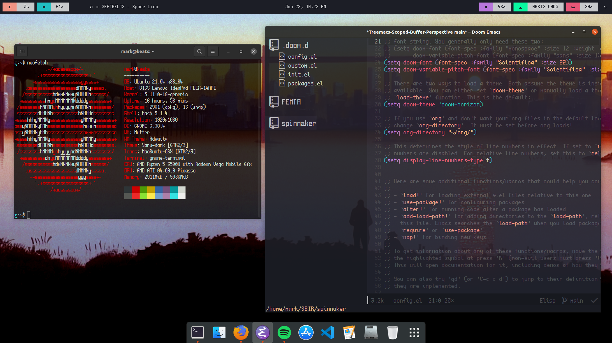

# dotfiles

This is an active repository holding my current dotfile setup. I'm running the latest Ubuntu version (21.04 at the time of writing) which uses Wayland as the display server and gdm3 as the display manager.

## Emacs

I use @hlissner's doom-emacs config setup, the doom-horizon theme, and Scientifica font.

## Polybar

I took inspiration from [u/rmw5601's post on Reddit](https://www.reddit.com/r/unixporn/comments/7wyzl1/i3_something_different/) and referenced [their dotfiles](https://github.com/reedrw/dotfiles) when making my own. Colors come from the doom-horizon theme, and I dereferenced all the `xrdb` colors to make it work with Wayland and gdm3.

I've also integrated @Jvanrhijn's polybar-spotify script to display what's currently playing.

## Result

